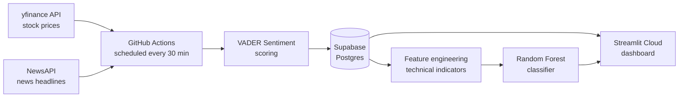

# Real-Time Stock Sentiment Predictor

A fully deployed, end-to-end machine learning pipeline that combines **live news sentiment** with **stock price technical indicators** to predict next-day price direction — built from raw data ingestion through cloud deployment, with zero dependency on any local machine.

**Live demo:** https://parichaysahu-realtime-stock-sentiment-app-6ihkas.streamlit.app

---

## Overview

This project started as an extension of a prior sentiment analysis project (Amazon reviews) and grew into a full real-time system covering the entire ML lifecycle: data ingestion, feature engineering, model training, and public deployment — all running continuously in the cloud.

Every 30 minutes, an automated pipeline pulls live stock prices and financial news headlines for a set of tickers, scores the sentiment of each headline, stores everything in a hosted Postgres database, and serves predictions through a live interactive dashboard.

## Architecture



Data collection runs entirely on GitHub's infrastructure via scheduled Actions — the pipeline keeps running whether or not any local machine is on.

## Features

- **Automated data ingestion**: live stock prices (`yfinance`) and financial news headlines (`NewsAPI`), refreshed every 30 minutes via GitHub Actions
- **Sentiment scoring**: headline-level sentiment via VADER, aggregated to daily sentiment scores per ticker
- **Technical indicators**: 7-day and 14-day moving averages, rolling volatility, daily returns
- **ML prediction**: Random Forest classifier predicting next-day price direction (up/down) from combined sentiment + technical features
- **Interactive dashboard**: live price charts, sentiment overlays, model predictions, and recent headlines — built with Streamlit and Plotly
- **Cloud-native**: hosted database (Supabase), scheduled compute (GitHub Actions), and web app (Streamlit Community Cloud) — no local infrastructure required

## Tech stack

| Layer | Tool |
|---|---|
| Data sources | yfinance, NewsAPI |
| Sentiment analysis | VADER (vaderSentiment) |
| Database | PostgreSQL (Supabase) |
| ML | scikit-learn (Random Forest) |
| Scheduling / automation | GitHub Actions |
| Dashboard | Streamlit, Plotly |
| Language | Python |

## Project structure

```
├── ingest_prices.py          # Pulls live stock prices, writes to Postgres
├── ingest_news.py            # Pulls headlines, scores sentiment, writes to Postgres
├── db_setup_postgres.py      # Creates database tables
├── app.py                    # Streamlit dashboard (reads from Postgres, serves predictions)
├── stock_sentiment_model.pkl # Trained Random Forest model
├── requirements.txt
├── config.example.py         # Template for local config (real config.py is gitignored)
└── .github/workflows/
    └── ingest.yml             # GitHub Actions workflow: runs ingestion every 30 min
```

## Data sources and known limitations

This project is transparent about the constraints of its free-tier data sources, since they directly affect model quality:

- **NewsAPI free tier** only returns articles from the last ~30 days, and (per its terms) is intended for development use — this limits how much historical sentiment data is available for training.
- **Training data size**: because the model only uses days with both price *and* news data, the current training set is small (tens of rows, not thousands). Reported predictions are a proof-of-concept of the full pipeline, not a statistically validated trading signal.
- **This is not financial advice.** The prediction is a demonstration of an ML pipeline combining sentiment and price data, not a recommendation to trade.

As the GitHub Actions workflow continues running, the dataset grows daily, and the model can be periodically retrained on more data.

## Running locally

1. Clone the repo and install dependencies:
   ```bash
   pip install -r requirements.txt
   ```
2. Copy `config.example.py` to `config.py` and fill in your own:
   - NewsAPI key ([newsapi.org](https://newsapi.org/register))
   - Supabase (or other Postgres) connection string
   - Ticker list
3. Set up the database tables:
   ```bash
   python db_setup_postgres.py
   ```
4. Run the dashboard:
   ```bash
   streamlit run app.py
   ```

## Roadmap

- [ ] Expand ticker coverage beyond AAPL, TSLA, NVDA
- [ ] Swap in a production-friendly news API for longer historical coverage
- [ ] Add a proper train/test split and backtesting once more data accumulates
- [ ] Experiment with transformer-based sentiment models (e.g. FinBERT) instead of VADER
- [ ] Add a Power BI / SQL-based reporting layer on top of the Supabase database

## Author

Built by [Parichay Sahu](https://github.com/Parichaysahu) as an end-to-end ML engineering project — from raw data through cloud deployment.
